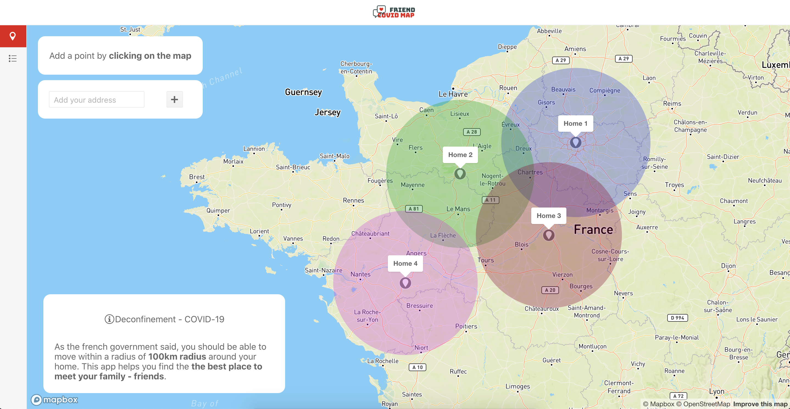

<p align="center">
  
</p>

**Deconfinement - COVID-19**    
As the french government said, you should be able to move within a radius of 100km radius around your home. This app helps you find the the best place to meet your family - friends.

This project was built during the react-europe hackathon 2020 using ReactJS, TypeScript, redux, redux-observable, styled-components, mapbox and KendoReact.

(**NOTE**: I would have liked to add more stuff to the project: tests, CI/CD... and more features too. Feel free to open an issue if you want to add something to the project !)

## Screens

### Map

<p align="center">
  
</p>

### Dashboard

<p align="center">
  
</p>

## Project structure

```
├── src
│   ├── components // This is where our React components will live (atoms, molecules...)
│   ├── actions // This is where our Redux actions will live
│   ├── store // This is where our Redux reducers are
│   ├── store // This is where our Store config is
│   ├── store // This is the place for our assets
│   ├── epics // This is where our Redux-Observable epics will live
│   ├── utils // This the place to put our utilities
│   ├── navigation // This is where our router will live
```